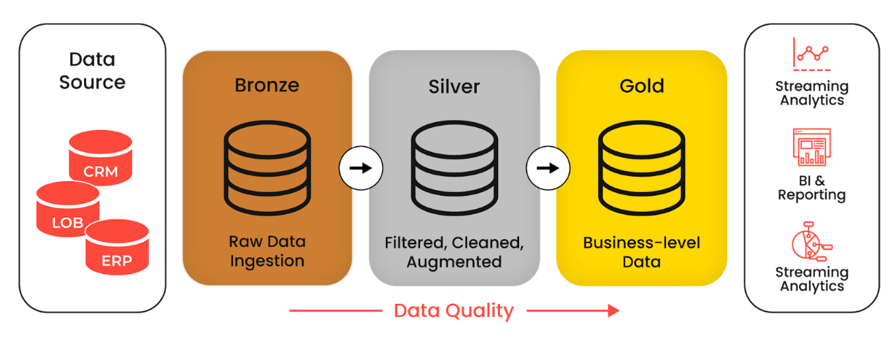

# OpenWeather-to-PostgreSQL Automated Pipeline

A production grade Python data engineering pipeline that extracts real-time weather forecasts for Lima, Peru via the 
OpenWeather API, with the purpose to see the effects of El Nino in its origin of the western coast of South America. 

This project demonstrates foundational data engineering principles, including **configuration management**, **logging**,
**environment isolation**, and **containerized warehousing**.

---

## Project Purpose and Architecture
It is projected that in between late 2026 and early 2027 a "super" version of the El Niño climate phenomenon will take place,
starting in South America, close to Peru. Because of this, 2027 might be the hottest year on record globally. 

Despite it being a natural phenomenon, its threats to the world can be amplified by human-made climate change. Using
weather data from near Lima, Peru, we can streamline data through a pipeline into a database, with the quality and clean data in the database being ready for 
BI analysis, extracting insights on how the weather changes over time in that region, therefore taking action based on the insights.

The goal of this project is to simulate a robust, business-ready data ingestion engine. Instead of dumping raw, low quality data 
into an analytical layer for data scientists and analysts, this pipeline organizes
data sequentially through the **Medallion Architecture**
to ensure data quality, reliability, and historical lineage.


*Image source: DataForge https://www.dataforgelabs.com/data-transformation-tools/medallion-architecture/* 
### Medallion Tier Implementation
1. **Bronze**: Raw ingestion, captures the API response in memory, preserving structural metadata such as data types and original nesting keys. 
2. **Silver**: Clean and validated, parses the multi-tiered forecast arrays. It isolates target metrics, such as temperature, humidity and conditions;
standardizes date-time formats (pd.to_datetime), adds timestamps, filters null entries, and appends rows into the relational database.
3. **Gold**: Business-ready analytical insights, computes key metrics using aggregated SQL relational schemas optimized for reporting tools and BI dashboards.

## Installation and Local Environment Setup
### Prerequisites
Ensure you have the following software infrastructure active:
* **Docker Desktop** (with WSL2 integration for optimal speed)
* **Python 3.11+** installed on your host/WSL subsystem

### Environment Configuration
Clone the repo, navigate to the project directory, and create an .env file in the root folder.

### Containerize PostgreSQL 
Run the following Docker container deployment to initialize your persistent PostgreSQL instance mapped to either port 5432
or port 5433:

```bash:
docker run --name weather-postgres \
POSTGRES_USER=postgres \
POSTGRES_PASSWORD=<your_password>
POSTGRES_DB=weather_db\
-p 5433:5432 \
-d postgres
```

### Isolate Python Workspace Dependencies
Generate an isolated Python virtual environment (venv), activate it within shell runtime, and install the prerequisites:
```bash
python3 -m venv venv

source venv/bin/activate

pip install -r requirements.txt
```

---
## What to add/improve
Solve current PostgreSQL configuration errors (current). 